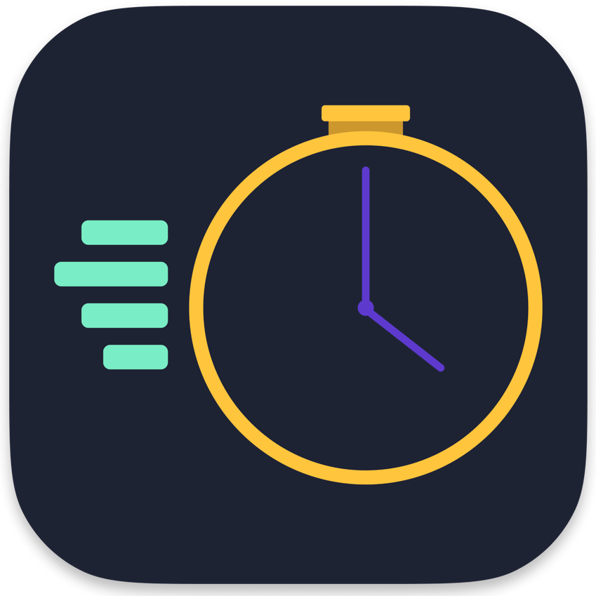

	
	<h1 align="center">SpeedrunTracker</h1>
	
SpeedrunTracker is a tool for Speedrunners to track their times, PB(s) and WR(s) for any games ! SpeedrunTracker also has an option to sync runs  from speedrun.com leaderboard. Will be ported to Windows in the next months, only available for macOS (Intel & Apple Silicon) in beta for now

	
Note : This utility is in development, if you have any issue or bug in the app, please report it with GitHub Issues.

<h6 align="center">Shuuut... I will make a better readme in few days, let me the time to think it 🤔 </h6>
